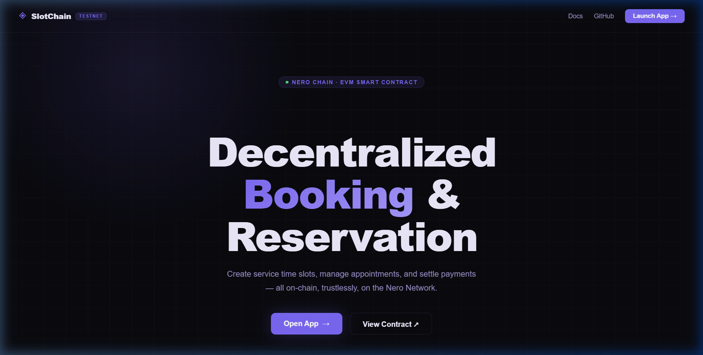
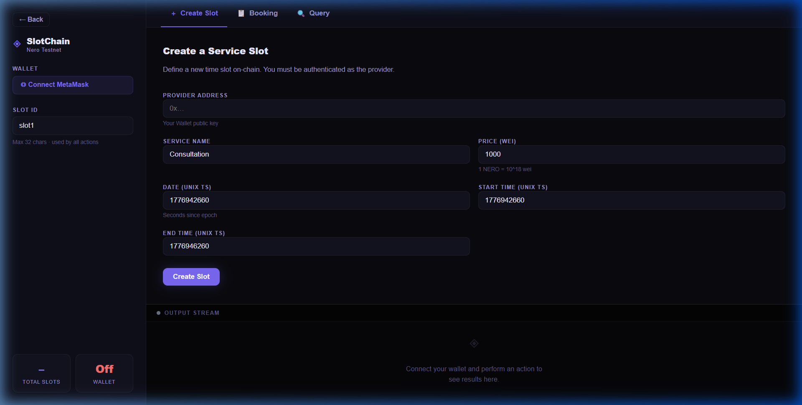
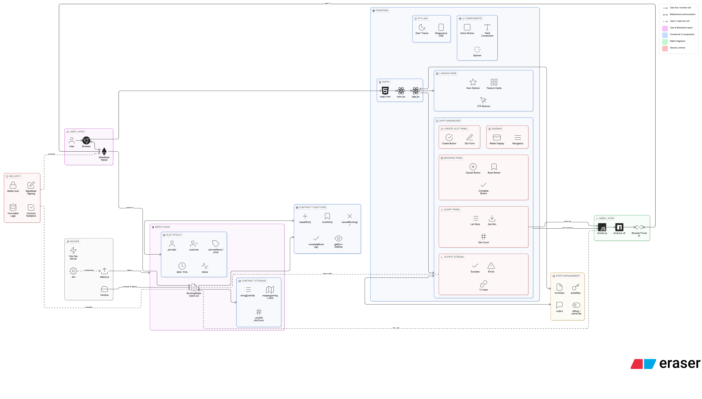

<p align="center">
  
</p>

<h1 align="center">SlotChain — Decentralized Booking & Reservation</h1>

<p align="center">
  <strong>Create service time slots, manage appointments, and settle payments — all on-chain, trustlessly, on the Nero Network.</strong>
</p>

<p align="center">
  
  
  
  
  
  
</p>

---

## 📸 Preview

### Landing Page
<p align="center">
  
</p>

### DApp Interface — Create Slot
<p align="center">
  
</p>

---

## 📋 Table of Contents

- [Overview](#-overview)
- [Features](#-features)
- [System Architecture](#-system-architecture)
- [Tech Stack](#-tech-stack)
- [Project Structure](#-project-structure)
- [Prerequisites](#-prerequisites)
- [Getting Started](#-getting-started)
  - [1. Clone the Repository](#1-clone-the-repository)
  - [2. Install Frontend Dependencies](#2-install-frontend-dependencies)
  - [3. Install Smart Contract Dependencies](#3-install-smart-contract-dependencies)
  - [4. Configure Environment Variables](#4-configure-environment-variables)
  - [5. Compile the Smart Contract](#5-compile-the-smart-contract)
  - [6. Deploy to Nero Testnet](#6-deploy-to-nero-testnet)
  - [7. Update the Frontend with Contract Address](#7-update-the-frontend-with-contract-address)
  - [8. Run the Development Server](#8-run-the-development-server)
- [Smart Contract Reference](#-smart-contract-reference)
- [Frontend Architecture](#-frontend-architecture)
- [MetaMask Setup for Nero Chain](#-metamask-setup-for-nero-chain)
- [How It Works](#-how-it-works)
- [API Reference — lib/nero.js](#-api-reference--liberojs)
- [Troubleshooting](#-troubleshooting)
- [Contributing](#-contributing)
- [License](#-license)

---

## 🧭 Overview

**SlotChain** is a fully decentralized booking and reservation system built on the **Nero Chain** (EVM-compatible). It enables service providers to create time slots, customers to book them, and both parties to manage the booking lifecycle — all enforced by a Solidity smart contract.

No middlemen. No custodial risk. Every action is signed by the user's **MetaMask wallet** and recorded immutably on-chain.

### Use Cases
- **Freelancers** — Offer consultation slots with on-chain payment tracking
- **Clinics / Salons** — Manage appointment availability transparently
- **Tutors / Mentors** — Schedule 1-on-1 sessions with trustless booking
- **Co-working Spaces** — Reserve meeting rooms or desks on-chain

---

## ✨ Features

| Feature | Description |
| --- | --- |
| ⏰ **Time Slot Management** | Create granular time slots with custom pricing, service names, and availability windows |
| 🔐 **On-Chain Authentication** | All bookings are signed via MetaMask wallet — no custodial risk, no middlemen |
| ✅ **State Machine Logic** | Slots flow through `available → booked → completed` (or `cancelled`) with full auditability |
| ⚡ **EVM Compatible** | Built on Nero Chain's EVM platform with fast finality and minimal fees |
| 🌐 **Open Protocol** | Any provider can list slots; any customer with a Web3 wallet can book |
| 📊 **Live Queries** | Read slot state instantly via view functions — no wallet needed to browse |
| 🔄 **Auto-Network Switch** | Frontend automatically prompts to switch/add the Nero Testnet in MetaMask |
| 🎨 **Premium UI** | Dark-themed glassmorphism design with micro-animations and interactive cursor effects |

---

## 🏗 System Architecture

<p align="center">
  
</p>

The system is organized into **four distinct layers** that communicate in a clear, linear pipeline:

### Layer 1 — Frontend (React 19 + Vite 8)

The user-facing layer is a single-page React application served by Vite's development server. It contains two views controlled by a simple `useState` toggle (no router):

- **`LandingPage`** — Marketing page with an interactive cursor-following glow effect, feature grid, step-by-step walkthrough, and CTA buttons that transition to the DApp.
- **`DApp`** — The core booking interface with a **sidebar** (wallet connect, slot ID input, live stats) and a **tabbed main panel** (Create Slot / Booking / Query). All blockchain responses are streamed into a live **Output Stream** panel at the bottom.

Every user action flows through a centralized `run(fn, label)` executor that handles loading states, error catching, JSON formatting, and auto-scrolling to results.

### Layer 2 — Web3 Abstraction (`lib/nero.js`)

This module is the **sole bridge** between the React UI and the blockchain. It exports 8 functions that abstract all Ethers.js `v6` complexity:

| Type | Functions | How it works |
| --- | --- | --- |
| **Connect** | `checkConnection()` | Calls `window.ethereum.request({method: 'eth_requestAccounts'})` via MetaMask |
| **Write** (costs gas) | `createSlot()`, `bookSlot()`, `cancelBooking()`, `completeBooking()` | Gets a **Signer** from `BrowserProvider` → builds a contract instance → calls the function → `tx.wait()` for block confirmation |
| **Read** (free) | `getSlot()`, `listSlots()`, `getSlotCount()` | Gets a **Provider** (no signer) → calls `view` functions via `eth_call` — no MetaMask popup, no gas |

The contract ABI is stored inline using Ethers.js human-readable format. BigInt values returned by the EVM are explicitly converted to strings for safe UI rendering.

### Layer 3 — Wallet (MetaMask)

MetaMask serves as the **authentication and transaction signing layer**. It injects `window.ethereum` into the browser, which Ethers.js wraps as a `BrowserProvider`. For write operations, MetaMask prompts the user to review and confirm the transaction before broadcasting it to the network.

### Layer 4 — Blockchain (Nero Chain EVM)

The `BookingReservation.sol` smart contract is deployed on Nero Chain's EVM-compatible testnet. It manages all state on-chain:

- **Storage:** `mapping(string => Slot)` for slot data, `string[]` for the ID index, `uint256` counter for total slots.
- **State machine:** Slots transition through `available → booked → completed` (or `cancelled`), enforced by validation checks and custom Solidity errors.
- **Access control:** `msg.sender` is checked against `provider` and/or `customer` addresses for write operations. No admin keys or owner privileges exist.

### End-to-End Data Flow (Write Operation)

```
User clicks "Create Slot"
  → DApp.run() sets loading state
    → nero.js gets Signer from MetaMask
      → MetaMask popup: "Confirm transaction?"
        → Signed TX broadcast to Nero Chain RPC
          → EVM validates & writes Slot to storage
            → Block confirmed → tx.wait() resolves
              → nero.js returns {ok: true, hash: "0x..."}
                → Output Stream renders green JSON result
```

### End-to-End Data Flow (Read Operation)

```
User clicks "Get Slot"
  → DApp.run() sets loading state
    → nero.js gets Provider (no signer needed)
      → eth_call sent to Nero Chain RPC (NO MetaMask popup)
        → EVM reads Slot from storage mapping
          → Returns Slot struct → BigInts converted to strings
            → Output Stream renders formatted JSON
```

---

## 🛠 Tech Stack

| Layer | Technology | Purpose |
| --- | --- | --- |
| **Smart Contract** | Solidity `0.8.20` | On-chain booking logic and state management |
| **Contract Tooling** | Hardhat | Compilation, testing, and deployment framework |
| **Frontend Framework** | React `19` | Component-based interactive UI |
| **Build Tool** | Vite `8` | Lightning-fast HMR development server |
| **Web3 Library** | Ethers.js `v6` | Contract interaction and wallet connectivity |
| **Wallet** | MetaMask | Transaction signing and account management |
| **Blockchain** | Nero Chain (EVM) | Testnet deployment target |
| **Styling** | Inline CSS-in-JS | Dark theme with glassmorphism aesthetics |

---

## 📁 Project Structure

```
booking-reservation-app/
├── docs/
│   └── assets/                    # Screenshots, logo, and demo media
│       ├── slotchain_logo.png     # Project logo
│       ├── landing_nero.png       # Landing page screenshot
│       └── dapp_nero.png          # DApp interface screenshot
│
├── evm-contracts/                 # Smart contract workspace
│   ├── contracts/
│   │   └── BookingReservation.sol # Main Solidity smart contract
│   ├── scripts/
│   │   └── deploy.js              # Deployment script for Nero Chain
│   ├── artifacts/                 # Compiled contract ABIs (auto-generated)
│   ├── cache/                     # Hardhat compilation cache
│   ├── .env                       # Private key & RPC URL (DO NOT COMMIT)
│   ├── hardhat.config.js          # Hardhat network configuration
│   └── package.json               # Contract workspace dependencies
│
├── lib/
│   └── nero.js                    # Web3 connector — MetaMask + Ethers.js
│
├── public/                        # Static assets served by Vite
├── src/
│   ├── App.jsx                    # Main application (Landing + DApp)
│   ├── App.css                    # Global application styles
│   ├── index.css                  # CSS reset and base styles
│   └── main.jsx                   # React DOM entry point
│
├── index.html                     # Vite HTML entry point
├── package.json                   # Frontend dependencies & scripts
├── vite.config.js                 # Vite build configuration
├── eslint.config.js               # ESLint configuration
├── .gitignore                     # Git ignore rules
└── README.md                      # This file
```

---

## 📦 Prerequisites

Before you begin, ensure you have the following installed on your system:

| Tool | Minimum Version | Download |
| --- | --- | --- |
| **Node.js** | `v18.0.0+` | [nodejs.org](https://nodejs.org/) |
| **npm** | `v9.0.0+` | Bundled with Node.js |
| **MetaMask** | Latest | [metamask.io](https://metamask.io/) |
| **Git** | Any | [git-scm.com](https://git-scm.com/) |

> **Note:** MetaMask must be installed as a browser extension and configured with the Nero Chain testnet. See the [MetaMask Setup](#-metamask-setup-for-nero-chain) section below.

---

## 🚀 Getting Started

Follow these steps **exactly in order** to get the project running locally.

### 1. Clone the Repository

```bash
git clone https://github.com/krish-crlt/booking_reservation_NERO.git
cd booking_reservation_NERO/booking-reservation-app
```

### 2. Install Frontend Dependencies

```bash
npm install
```

This installs React, Vite, Ethers.js, and all required development tools.

### 3. Install Smart Contract Dependencies

```bash
cd evm-contracts
npm install
cd ..
```

This installs Hardhat and the `@nomicfoundation/hardhat-ethers` plugin inside the contract workspace.

### 4. Configure Environment Variables

Create a `.env` file inside the `evm-contracts/` directory:

```bash
cd evm-contracts
```

Create a file named `.env` with the following contents:

```env
PRIVATE_KEY=your_metamask_private_key_here_without_0x_prefix
NERO_RPC_URL=https://testnet.nerochain.io
```

> ⚠️ **SECURITY WARNING:** Never commit your `.env` file to version control. The `.gitignore` should already exclude it, but double-check before pushing.

**How to export your MetaMask private key:**
1. Open MetaMask → Click the three-dot menu on your account
2. Select **Account Details** → Click **Show Private Key**
3. Enter your password and copy the key
4. Paste it into the `.env` file as the `PRIVATE_KEY` value

### 5. Compile the Smart Contract

```bash
cd evm-contracts
npx hardhat compile
```

**Expected output:**
```
Compiled 1 Solidity file successfully (evm target: paris).
```

This generates the ABI and bytecode in the `evm-contracts/artifacts/` directory.

### 6. Deploy to Nero Testnet

Make sure you have testnet NERO tokens in your wallet for gas fees, then run:

```bash
npx hardhat run scripts/deploy.js --network nero
```

**Expected output:**
```
BookingReservation deployed to 0xYourContractAddressHere
```

> 📝 **Copy this contract address** — you will need it in the next step.

### 7. Update the Frontend with Contract Address

Open `lib/nero.js` and replace the `CONTRACT_ADDRESS` value with your newly deployed address:

```javascript
// lib/nero.js — Line 4
export const CONTRACT_ADDRESS = "0xYourContractAddressHere";
```

### 8. Run the Development Server

Navigate back to the project root and start the Vite dev server:

```bash
cd ..
npm run dev
```

**Expected output:**
```
  VITE v8.x.x  ready in 500 ms

  ➜  Local:   http://localhost:5173/
  ➜  Network: use --host to expose
```

Open `http://localhost:5173/` in your browser. You should see the SlotChain landing page!

---

## 📜 Smart Contract Reference

### `BookingReservation.sol`

The smart contract is located at `evm-contracts/contracts/BookingReservation.sol` and manages the entire booking lifecycle.

### Data Structures

#### Slot Struct
```solidity
struct Slot {
    address provider;      // Service provider's wallet address
    address customer;      // Customer's wallet address
    bool    isBooked;      // Whether the slot is currently booked
    string  serviceName;   // Name of the service offered
    uint256 date;          // Date as Unix timestamp
    uint256 startTime;     // Start time as Unix timestamp
    uint256 endTime;       // End time as Unix timestamp
    uint256 price;         // Price in Wei
    string  status;        // "available" | "booked" | "completed" | "cancelled"
}
```

### Functions

| Function | Access | Gas | Description |
| --- | --- | --- | --- |
| `createSlot(id, serviceName, date, startTime, endTime, price)` | `msg.sender` = provider | Write | Creates a new available time slot |
| `bookSlot(id)` | `msg.sender` = customer | Write | Books an available slot |
| `cancelBooking(id)` | Provider or Customer | Write | Cancels a booked slot |
| `completeBooking(id)` | Provider only | Write | Marks a booked slot as completed |
| `getSlot(id)` | Anyone | View (free) | Returns full slot details |
| `listSlots()` | Anyone | View (free) | Returns array of all slot IDs |
| `getSlotCount()` | Anyone | View (free) | Returns total number of slots |

### Custom Errors
```solidity
error InvalidServiceName();  // Service name cannot be empty
error InvalidTimeRange();    // startTime must be < endTime
error AlreadyExists();       // Slot ID already registered
error NotFound();            // Slot ID not found
error AlreadyBooked();       // Slot is already booked
error NotBooked();           // Slot is not booked (can't cancel/complete)
error Unauthorized();        // Caller is not provider/customer
```

### State Flow
```
  ┌─────────────┐     bookSlot()     ┌──────────┐   completeBooking()   ┌──────────────┐
  │  available   │ ─────────────────→ │  booked  │ ────────────────────→ │  completed   │
  └─────────────┘                     └──────────┘                       └──────────────┘
                                           │
                                           │ cancelBooking()
                                           ▼
                                     ┌──────────────┐
                                     │  cancelled   │
                                     └──────────────┘
```

---

## 🖥 Frontend Architecture

The frontend is a **single-page React application** with two views:

### 1. Landing Page (`LandingPage` component)
- Interactive cursor-following glow effect
- Feature grid showcasing platform capabilities
- "How It Works" step-by-step guide
- CTA buttons to launch the DApp

### 2. DApp Interface (`DApp` component)

Organized into a **sidebar + tabbed main panel** layout:

| Element | Purpose |
| --- | --- |
| **Sidebar** | Wallet connection, Slot ID input, live stats (Total Slots, Wallet status) |
| **Create Slot Tab** | Form to define provider, service name, price, date, start/end times |
| **Booking Tab** | Book, cancel, or complete booking actions |
| **Query Tab** | Read-only queries: get slot details, list all, count total |
| **Output Stream** | Real-time transaction results and error messages |

---

## 🦊 MetaMask Setup for Nero Chain

To interact with the Nero Chain testnet, configure MetaMask with these network details:

| Field | Value |
| --- | --- |
| **Network Name** | Nero Chain Testnet |
| **RPC URL** | `https://testnet.nerochain.io` |
| **Chain ID** | Check [Nero Chain docs](https://docs.nerochain.io) for the latest |
| **Currency Symbol** | `NERO` |
| **Block Explorer URL** | Check [Nero Chain docs](https://docs.nerochain.io) for the latest |

**Steps:**
1. Open MetaMask → Click the network dropdown
2. Click **Add Network** → **Add a network manually**
3. Fill in the values from the table above
4. Click **Save**
5. Get testnet NERO tokens from the official faucet

---

## ⚙ How It Works

### For Providers
1. **Connect MetaMask** — Click "Connect MetaMask" in the sidebar
2. **Create a Slot** — Fill in service details (name, date, time, price) and submit
3. **Wait for Booking** — Customers can discover and book your slot
4. **Complete the Service** — After delivering the service, mark it as completed on-chain

### For Customers
1. **Connect MetaMask** — Authenticate with your wallet
2. **Browse Slots** — Use the Query tab to list available slots
3. **Book a Slot** — Enter the Slot ID and confirm through MetaMask
4. **Cancel if Needed** — Both provider and customer can cancel a booking

---

## 📚 API Reference — `lib/nero.js`

The `lib/nero.js` module provides a clean abstraction layer over the raw Ethers.js contract calls.

### `checkConnection()`
Prompts MetaMask to connect and returns the active account.
```javascript
const user = await checkConnection();
// → { publicKey: "0xAbC...123" } or null
```

### `createSlot(payload)`
Creates a new on-chain time slot.
```javascript
await createSlot({
  id: "meeting-room-a",
  serviceName: "Conference Room A",
  date: 1714000000,
  startTime: 1714003600,
  endTime: 1714007200,
  price: 1000  // in Wei
});
// → { ok: true, hash: "0x..." }
```

### `bookSlot(payload)`
Books an existing available slot.
```javascript
await bookSlot({ id: "meeting-room-a" });
// → { ok: true, hash: "0x..." }
```

### `cancelBooking(payload)`
Cancels a booked slot (callable by provider or customer).
```javascript
await cancelBooking({ id: "meeting-room-a" });
// → { ok: true, hash: "0x..." }
```

### `completeBooking(payload)`
Marks a booked slot as completed (provider only).
```javascript
await completeBooking({ id: "meeting-room-a" });
// → { ok: true, hash: "0x..." }
```

### `getSlot(id)`
Fetches full details of a specific slot (read-only, no gas).
```javascript
const slot = await getSlot("meeting-room-a");
// → { provider, customer, isBooked, serviceName, date, startTime, endTime, price, status }
```

### `listSlots()`
Returns all registered slot IDs (read-only, no gas).
```javascript
const ids = await listSlots();
// → ["meeting-room-a", "slot-2", ...]
```

### `getSlotCount()`
Returns the total count of registered slots (read-only, no gas).
```javascript
const count = await getSlotCount();
// → 5
```

---

## 🔧 Troubleshooting

| Problem | Solution |
| --- | --- |
| **MetaMask not detected** | Ensure MetaMask browser extension is installed and enabled |
| **Wrong network** | Switch MetaMask to Nero Chain Testnet |
| **Transaction fails** | Ensure you have sufficient NERO testnet tokens for gas |
| **Contract address mismatch** | Verify `CONTRACT_ADDRESS` in `lib/nero.js` matches the deployed address |
| **`npx hardhat compile` fails** | Run `cd evm-contracts && npm install` first |
| **Port 5173 in use** | Kill the existing process or Vite will auto-select the next port |
| **`ENOTFOUND` on deploy** | Check your internet connection and verify the `NERO_RPC_URL` in `.env` |

---

## 🤝 Contributing

Contributions are welcome! Here's how to get started:

1. **Fork** the repository
2. Create a **feature branch**: `git checkout -b feature/your-feature`
3. **Commit** your changes: `git commit -m "Add your feature"`
4. **Push** to the branch: `git push origin feature/your-feature`
5. Open a **Pull Request**

### Development Guidelines
- Follow the existing code style (ESLint is configured)
- Test contract changes with `npx hardhat test` before submitting
- Keep UI components inside `src/App.jsx` (single-file architecture)
- Web3 logic belongs in `lib/nero.js`

---

## 📄 License

This project is licensed under the **MIT License**. See the [LICENSE](LICENSE) file for details.

---

<p align="center">
  <strong>Built with ◈ on Nero Chain · EVM</strong><br/>
  <sub>SlotChain — Trustless Booking for the Decentralized Web</sub>
</p>
